# 사용자 가이드

> 이 문서는 게이트웨이를 **쓰는 사람**(AI 코딩 도구를 연결하는 개발자, 자기 팀의 사용량을 보는 사람)을 위한 것입니다. 게이트웨이를 **띄우고 지키는** 방법은 [관리자 가이드](ADMIN_GUIDE.md)에 있습니다. PDF: [USER_GUIDE.pdf](USER_GUIDE.pdf)

## 1. 이 제품이 하는 일

Vibe Coders 는 AI 코딩 도구(Roo Code, Cline, Cursor, Continue, OpenAI SDK 등)와 LLM 공급자 사이에 서는 **AI 프록시 게이트웨이**입니다. 도구의 Base URL 을 게이트웨이 주소로 바꾸면, 코드나 워크플로를 바꾸지 않아도 모든 호출이 게이트웨이를 지나며 사용량·비용·지연·언어 통계가 회사에 기록됩니다.

게이트웨이는 업스트림 API 키를 대신 보관하고, 개발자에게는 **proxy key** 하나만 줍니다. 프롬프트에 섞인 주민번호·카드번호·클라우드 키 같은 비밀은 자동으로 마스킹되고, 팀·키·IP 단위의 비용 한도와 정책이 호출 시점에 적용됩니다.

콘솔(`/app`)에서는 자기 사용량과 팀 대시보드, 요청 이력, 세션 비행기록을 볼 수 있습니다. 관리자 역할이면 같은 콘솔에서 사용자·정책·비용·보안 설정까지 다룹니다.

## 2. 처음 5분

로그인부터 첫 호출이 콘솔에 잡히는 것까지 한 번에 따라 합니다. 운영자에게 **게이트웨이 주소**(예: `http://proxy-gateway.intra:8080`), **콘솔 계정**(이메일·비밀번호 또는 SSO), **proxy key**(`pcg_…` — 한 번만 표시되니 받자마자 보관)를 받아 두세요.

### 2.1 콘솔에 로그인

브라우저에서 `http://<게이트웨이>/app` 을 엽니다. 운영자가 계정 로그인(`AUTH_ENABLED=true`)을 켰다면 이메일·비밀번호 폼이, 기존 관리자 토큰 방식이면 토큰 입력란이, SSO 를 켰다면 SSO 버튼이 보입니다.

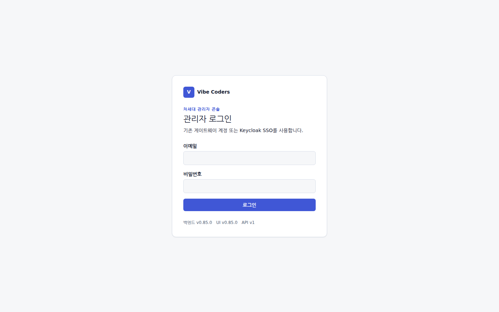

### 2.2 도구의 Base URL 을 바꾼다

OpenAI SDK / Roo Code / Cline / Cursor 모두 같은 패턴입니다.

| 항목 | 기존 | 변경 |
| --- | --- | --- |
| Base URL | `https://api.openai.com/v1` | `http://proxy-gateway.intra:8080/v1` |
| API Key | `sk-…` (OpenAI 발급) | `pcg_…` (회사 발급 proxy key) |
| 모델명 | `gpt-4.1-mini` 등 | 그대로 사용 |

도구별 화면 위치는 [4.1 도구별 연결 설정](#41-도구별-연결-설정)에 있습니다. 터미널에서 바로 확인하려면:

```bash
curl -sS http://proxy-gateway.intra:8080/v1/chat/completions \
  -H "Authorization: Bearer pcg_xxxxxxxx" -H "Content-Type: application/json" \
  -d '{ "model": "gpt-4.1-mini", "messages": [{ "role": "user", "content": "안녕" }] }'
```

응답 헤더의 `X-Request-ID` 가 이 호출의 요청 ID 입니다.

### 2.3 콘솔에서 내 호출을 찾는다

왼쪽 메뉴 **개요 → 내 홈**을 열면 방금 호출이 본인 사용량으로 잡혀 있습니다.

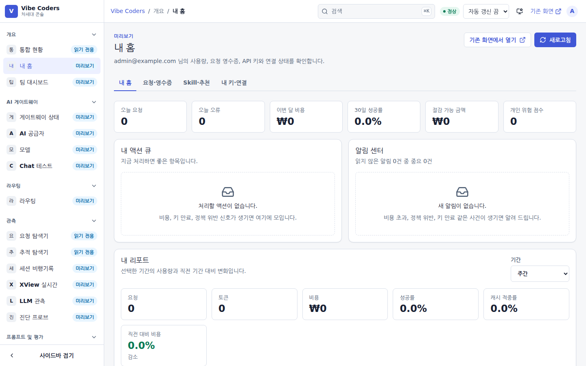

**관측 → 요청 탐색기**에서 "요청 ID" 필터에 `X-Request-ID` 값을 넣고 **조회**를 누르면 그 호출 한 건의 상태·모델·지연·토큰·비용이 나옵니다.

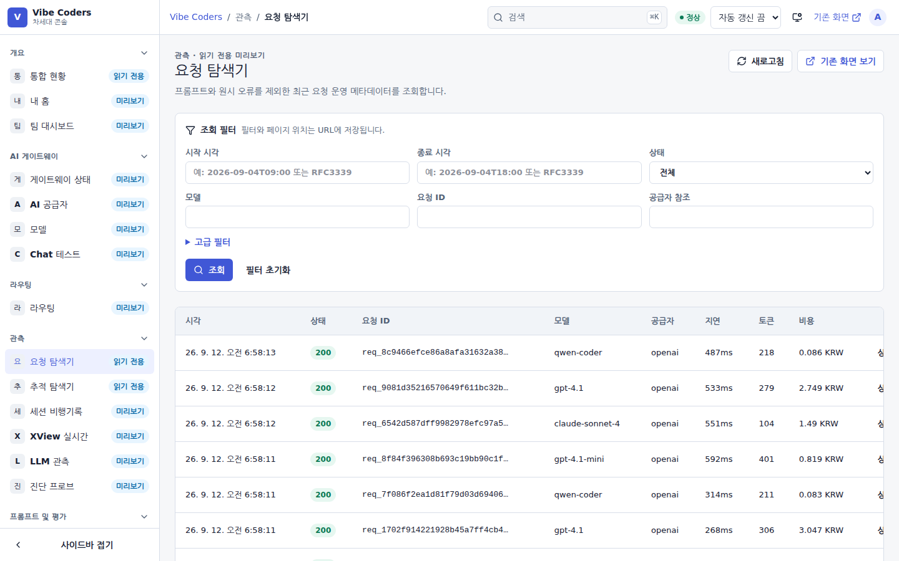

여기까지 되면 연결이 끝난 것입니다. 통계가 `anonymous` 나 `passthrough` 로 잡히면 등록되지 않은 키를 쓰고 있는 것이니 [5.3](#53-자주-묻는-질문)을 보세요.

## 3. 화면별 사용법

메뉴 이름은 콘솔 왼쪽 사이드바의 문구 그대로입니다. 오른쪽 위 **검색**(`⌘K` / `Ctrl+K`)에 화면 이름을 치면 바로 이동합니다. 배지 **읽기 전용**은 보기만 되는 화면, **미리보기**는 새 콘솔로 옮겨진 화면입니다. **기존 화면** 링크는 같은 데이터를 예전 `/admin` 화면에서 엽니다.

### 3.1 통합 현황

게이트웨이 상태, 보존 트래픽과 비용, 프로세스 런타임(P95 지연·캐시 적중률·장애 전환), 라우팅 상태, 운영 위험을 한 화면에서 봅니다. 기간은 **1시간 / 24시간 / 7일 / 30일** 버튼으로 바꿉니다. 탭 **운영 상태 / 사용 현황 / 기능 맵** 으로 관점을 바꿀 수 있습니다.

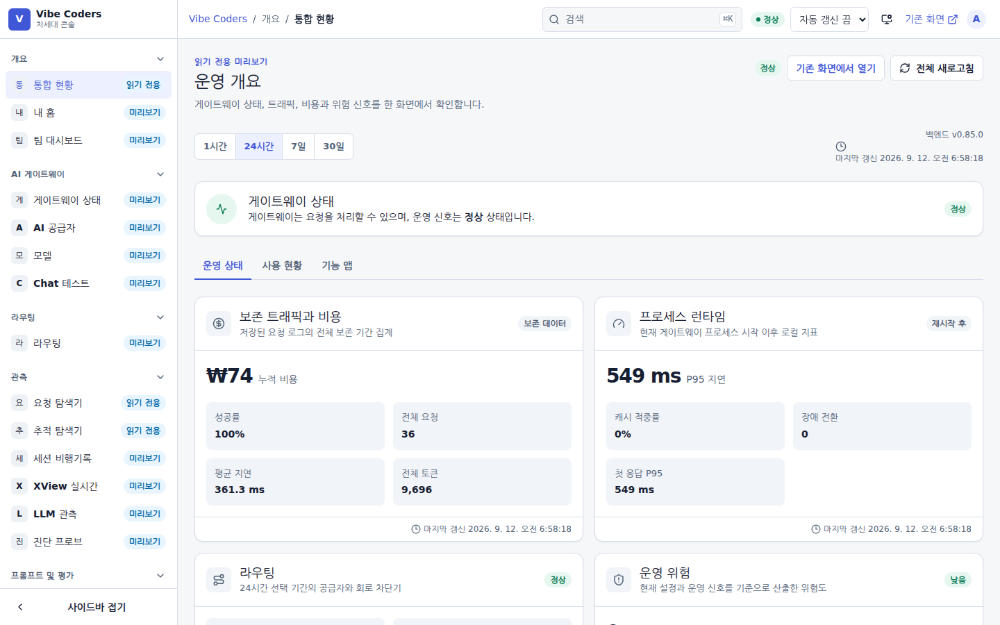

### 3.2 내 홈 · 팀 대시보드

**내 홈**은 로그인한 본인의 요청·토큰·비용·최근 호출입니다. **팀 대시보드**는 소속 팀의 합계와 팀원별 분포입니다. 월말 정산이나 "누가 얼마나 썼나"는 여기서 봅니다.

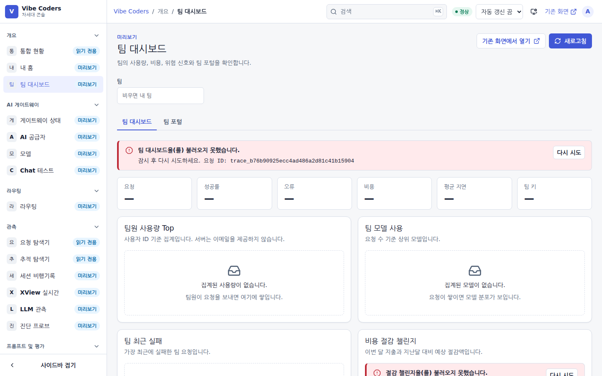

### 3.3 요청 탐색기 · 추적 탐색기

**요청 탐색기**는 최근 요청의 운영 메타데이터(프롬프트 본문 제외)입니다. 시작·종료 시각, 상태, 모델, 요청 ID, 공급자 참조로 거르고 **고급 필터**를 펼치면 더 좁힐 수 있습니다. 필터와 페이지 위치는 URL 에 저장되므로 링크를 그대로 동료에게 보낼 수 있습니다. 행을 클릭하면 단건 상세가 열립니다.

**추적 탐색기**는 한 요청이 파이프라인의 어떤 단계(인증 → 정책 → 라우팅 → 업스트림 → 로깅)를 얼마 만에 지났는지 봅니다.

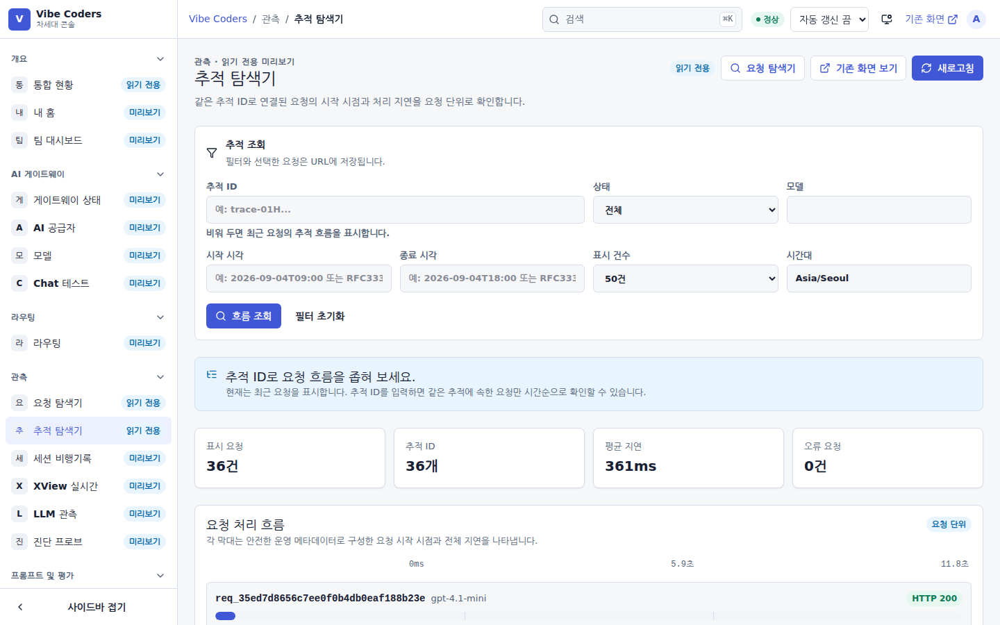

### 3.4 세션 비행기록 · XView 실시간 · LLM 관측

- **세션 비행기록**: 같은 `X-Vibe-Session` 으로 묶인 에이전트 세션을 시간순으로 되짚습니다. 도구 호출·재시도·비용이 한 줄에 놓입니다.
- **XView 실시간**: 트랜잭션 응답시간 분포를 점으로 실시간 표시합니다. 점을 클릭하면 그 요청이 왜 그렇게 처리됐는지 설명이 뜹니다.
- **LLM 관측**: 모델별 토큰·지연·오류율과 평가 결과입니다.

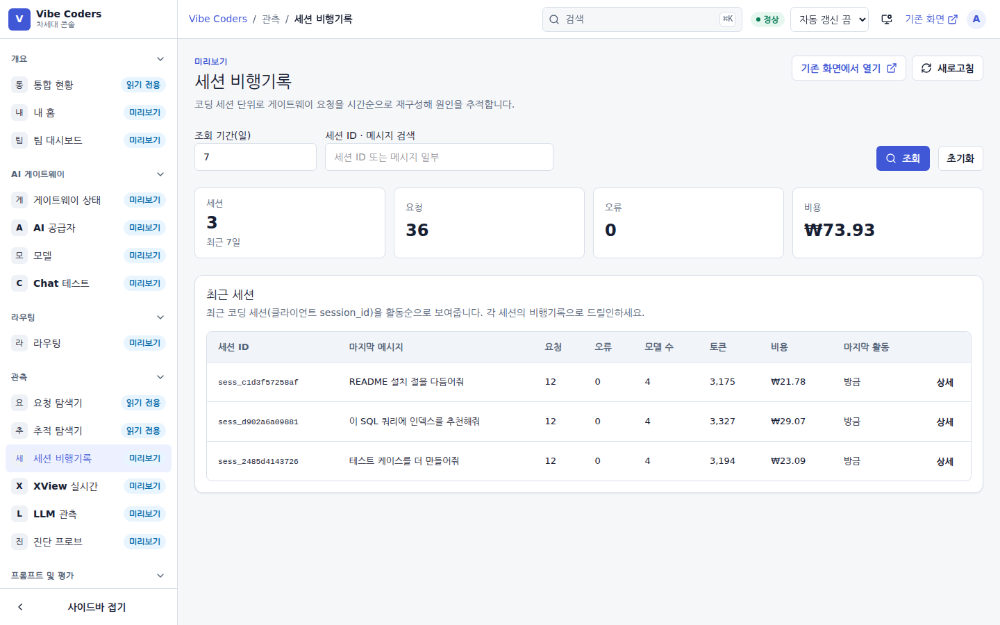

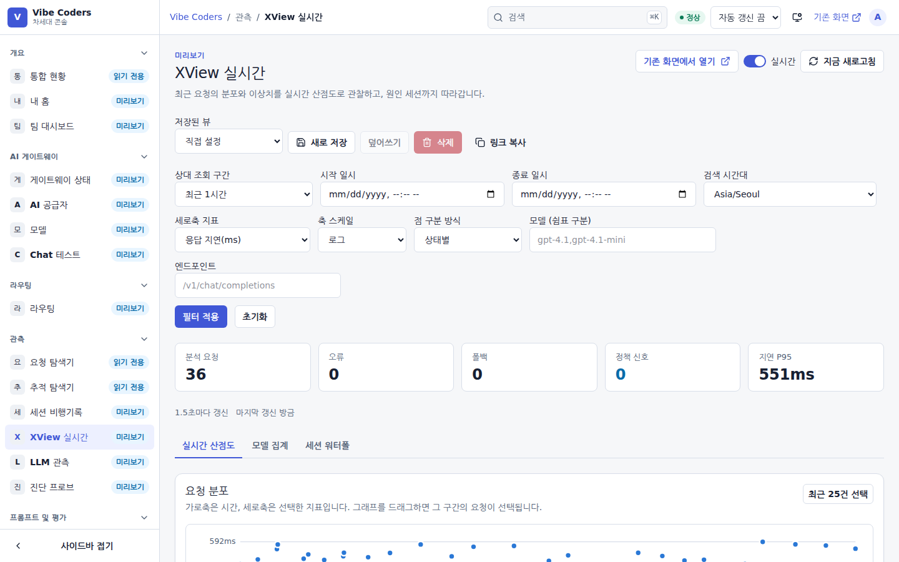

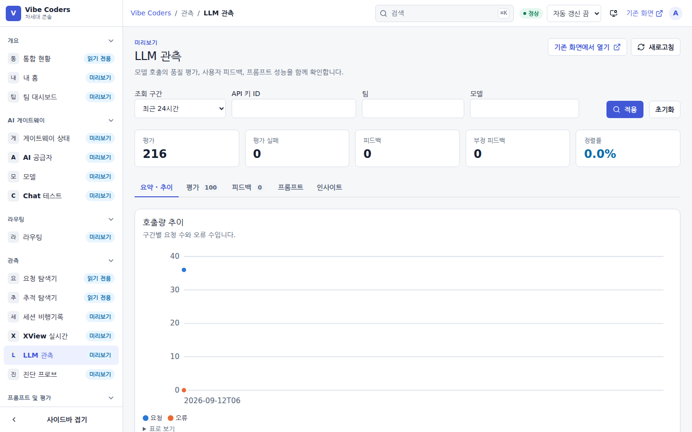

### 3.5 Chat 테스트 · 모델

**Chat 테스트**는 콘솔 안에서 모델에 바로 말을 걸어 보는 화면입니다. 도구 설정이 맞는지 의심될 때 게이트웨이 자체는 정상인지 여기서 먼저 가릅니다. **모델**은 게이트웨이가 노출하는 모델 목록과 각 모델의 공급자·가격입니다.

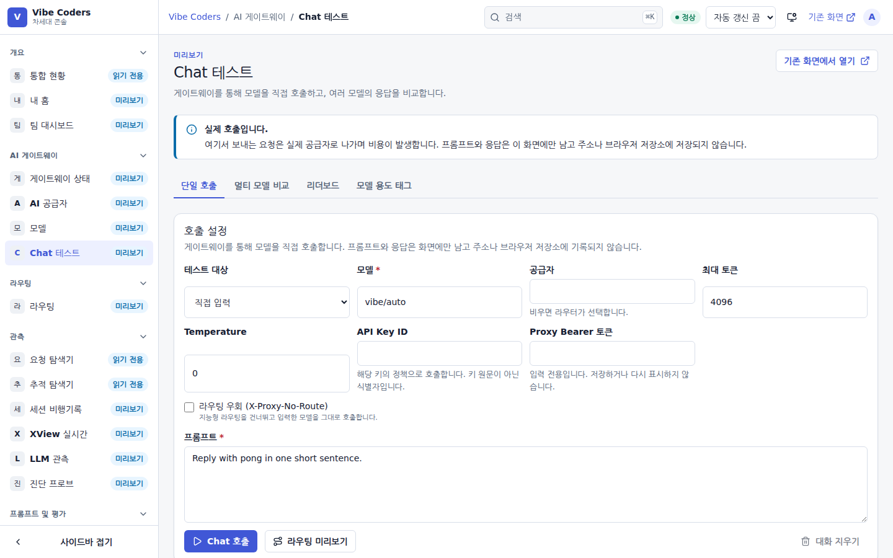

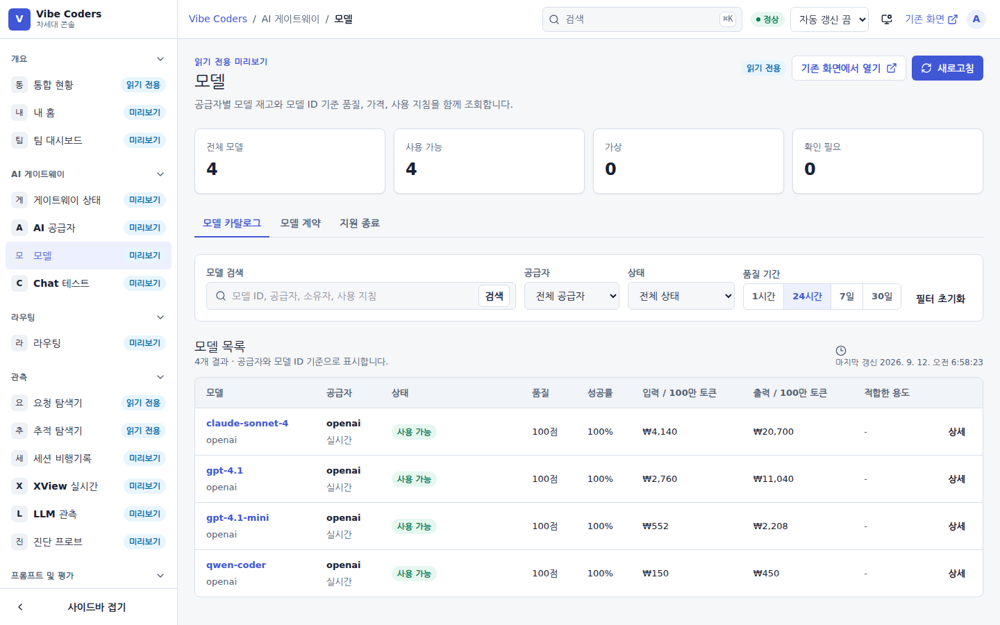

### 3.6 프롬프트 라이브러리

팀이 공유하는 프롬프트 템플릿과 골든 프롬프트(회귀 검사용)입니다. 반복해서 쓰는 지시문은 여기 올려 두고 `X-Vibe-Knowledge` 헤더로 끌어 씁니다([4.1 의 Knowledge Cache](#41-도구별-연결-설정)).

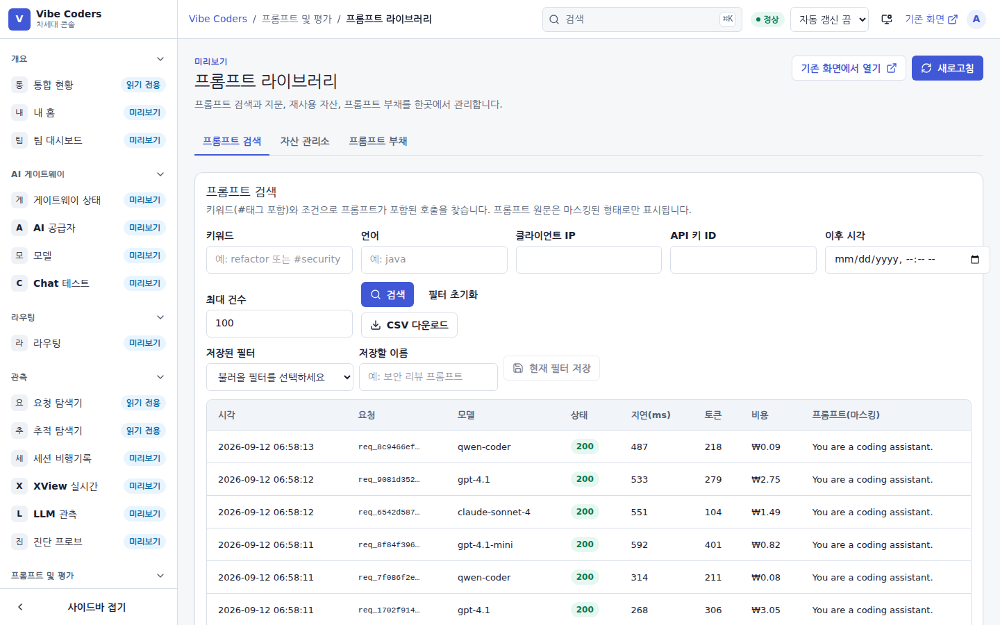

## 4. 자주 하는 작업

### 4.1 도구별 연결 설정

#### 4.1.1 Roo Code (VS Code 확장)

1. VS Code 설정에서 `Roo Code: OpenAI Base URL` 검색
2. `http://proxy-gateway.intra:8080/v1` 입력
3. `Roo Code: OpenAI API Key` 에 `pcg_xxxxxxxx...` 입력
4. 모델을 평소 쓰던 것 (`gpt-4.1-mini` 등) 으로 선택

#### 4.1.2 Cline

1. 설정 → API Provider 를 `OpenAI Compatible` 로 선택
2. Base URL: `http://proxy-gateway.intra:8080/v1`
3. API Key: `pcg_...`
4. Model: 원하는 모델명 (`gpt-4.1-mini`, `claude-3-5-sonnet` 등)

#### 4.1.3 Cursor

1. `Cmd/Ctrl + ,` → `Cursor Settings` → `Models`
2. "Add Custom OpenAI Base URL" 토글
3. URL: `http://proxy-gateway.intra:8080/v1`
4. API Key: `pcg_...`

#### 4.1.4 Continue (VS Code/JetBrains)

`~/.continue/config.json` 의 model 에 다음 추가:

```json
{
  "models": [
    {
      "title": "회사 프록시",
      "provider": "openai",
      "model": "gpt-4.1-mini",
      "apiBase": "http://proxy-gateway.intra:8080/v1",
      "apiKey": "pcg_xxxxxxxx..."
    }
  ]
}
```

#### 4.1.5 OpenAI Python SDK

```python
from openai import OpenAI

client = OpenAI(
    base_url="http://proxy-gateway.intra:8080/v1",
    api_key="pcg_xxxxxxxx...",
)

resp = client.chat.completions.create(
    model="gpt-4.1-mini",
    messages=[{"role": "user", "content": "main.go 를 리팩터링해줘"}],
)
print(resp.choices[0].message.content)
```

#### 4.1.6 OpenAI Node SDK

```ts
import OpenAI from "openai";

const client = new OpenAI({
  baseURL: "http://proxy-gateway.intra:8080/v1",
  apiKey: "pcg_xxxxxxxx...",
});

const resp = await client.chat.completions.create({
  model: "gpt-4.1-mini",
  messages: [{ role: "user", content: "src/foo.ts 검토" }],
});
console.log(resp.choices[0].message.content);
```

#### 4.1.7 curl

```bash
curl http://proxy-gateway.intra:8080/v1/chat/completions \
  -H "Authorization: Bearer pcg_xxxxxxxx..." \
  -H "Content-Type: application/json" \
  -d '{
    "model": "gpt-4.1-mini",
    "stream": true,
    "messages": [{"role":"user","content":"hello"}]
  }'
```

`stream=true` 도 일반 OpenAI 응답과 동일하게 SSE 로 즉시 흘러나옵니다(게이트웨이가 버퍼링하지 않음).

#### 4.1.8 선택: LLM 관측 메타데이터

운영자가 세션별 비용, 프롬프트 버전별 품질, 평가 실패를 추적해야 한다면 클라이언트에서 다음 헤더를 추가할 수 있습니다.

```bash
X-LLM-Session-ID: sess-123
X-LLM-Prompt-Name: code-review
X-LLM-Prompt-Version: v7
X-LLM-Prompt-Variables-Hash: vars-sha256
```

헤더가 없어도 호출은 정상 처리됩니다. prompt 메타데이터가 없으면 prompt는 `ad-hoc` 으로 표시됩니다. session은 아래 규칙으로 자동 그룹화됩니다.

#### 세션 그룹화 — 무엇을 보내면 되나

게이트웨이는 **명시적 → 추론** 순으로 세션을 정합니다.

- **세션을 보내는 경우**(권장): 다음 중 아무거나. 헤더가 바디보다 우선합니다.
  - 헤더: `X-Session-ID`, `X-Vibe-Session-ID`, `X-Conversation-ID`
  - 바디 필드: `session_id`(Langflow), `chat_id`(OpenWebUI), `conversation_id`, `thread_id`, 또는 `metadata.session_id`
- **세션을 안 보내는 경우**(Claude Code·Cursor·Roo·Qwen 등 대부분의 코딩 툴): 게이트웨이가 `api_key + IP + User-Agent` 신원과 **30분 비활성 윈도우**로 세션(`sess_…`)을 자동 추론합니다. 한 작업 흐름의 연속 호출이 자연스럽게 한 세션으로 묶입니다. 30분 이상 멈췄다가 다시 호출하면 새 세션이 됩니다.

repo/branch 단위로 더 잘게 나누고 싶으면 `X-Vibe-Repo`·`X-Vibe-Branch` 헤더를 추가하세요(추론 신원에 반영됨). 한 작업을 확실히 한 세션으로 고정하려면 작업 시작 시 만든 UUID를 매 호출에 `X-Vibe-Session-ID` 로 보내는 것이 가장 정확합니다.

#### 커밋/MR 과 세션 연결 (Prompt → Commit → MR)

프롬프트가 어떤 커밋·MR 로 이어졌는지 추적하려면, **커밋 메시지나 MR 제목에 세션 마커**를 넣으세요. 운영자가 GitLab/Bitbucket 웹훅을 게이트웨이에 연결해 두었다면 자동으로 세션·사용자에 연결됩니다.

```
refactor OrderController

Vibe-Session: sess_8f34ab29     # 또는 [vibe:sess_8f34ab29]
```

`commit-msg` git 훅이나 커밋 템플릿으로 현재 세션 ID 를 자동 삽입하면 편리합니다. 세션 ID 는 `/v1` 응답을 직접 못 보는 도구라면 운영자에게 문의하거나, 직접 `X-Vibe-Session-ID` 로 지정한 값을 그대로 쓰면 됩니다.

#### 4.1.9 MCP / 도구 사용 가시성

MCP 서버나 function calling 을 쓰는 경우(예: `tools` 배열을 보내거나 `tool_calls` 가 오가는 경우), 게이트웨이가 자동으로 어떤 서버·도구가 호출·실패했는지 집계합니다. 별도 설정은 필요 없습니다. `mcp__<서버>__<도구>` 형태의 도구 이름은 서버별로 자동 분류됩니다. 도구 결과(`role:tool`)가 오류(`{"isError":true}` 등)이면 어드민 MCP 탭에서 오류로 집계되고, 운영자가 `tool_error_rate` 알림을 걸어두었다면 임계치 초과 시 통보됩니다.

#### 4.1.10 Knowledge Cache — 반복 규칙을 짧게 참조하기

매번 같은 코딩 규칙·시스템 프롬프트를 통째로 보내는 대신, 운영자가 등록한 지식을 **ID로 참조**할 수 있습니다. 게이트웨이가 업스트림 전송 시 전체 본문으로 확장합니다(모델은 전체 텍스트를 받습니다).

```bash
# 방법 1) 메시지 본문 안에 플레이스홀더
{ "model":"gpt-4.1", "messages":[
  { "role":"user", "content":"{{kb:coding-standards}}\n\n위 규칙에 맞게 main.go 리팩터링" }
]}

# 방법 2) 헤더로 지식 주입 (시스템 메시지로 맨 앞에 추가됨)
curl http://proxy-gateway.intra:8080/v1/chat/completions \
  -H "Authorization: Bearer pcg_..." \
  -H "X-Vibe-Knowledge: coding-standards,security-rules" \
  -H "Content-Type: application/json" \
  -d '{ "model":"gpt-4.1", "messages":[{ "role":"user", "content":"main.go 리팩터링" }] }'
```

- 사용 가능한 ID는 운영자에게 문의하세요(설정 탭에 등록). 등록 안 된/중지된 ID는 확장되지 않고 플레이스홀더가 그대로 남습니다.
- 확장 여부는 응답 헤더 `X-Knowledge-Expanded: <id,...>` 로 확인할 수 있습니다.
- 장점: 규칙이 바뀌어도 클라이언트 수정 없이 자동 반영, 매 호출 본문이 짧아짐.

#### 4.1.10b 비용 예측 헤더 / 큰 호출 승인

모든 chat 응답에는 게이트웨이가 호출 전에 추정한 값이 헤더로 붙습니다: `X-Estimated-Input-Tokens`, `X-Estimated-Output-Tokens`, `X-Estimated-Cost-KRW`, `X-Estimated-Latency-MS`. (`X-Api-Key-Id` 로 어떤 키로 인식됐는지도 확인할 수 있습니다.)

운영자가 **비용 가드**를 켜 둔 경우, 예상 비용이 임계값을 넘는 호출은 `HTTP 402` 로 거부됩니다. 의도한 대형 작업이면 같은 요청에 `X-Cost-Approve: 1` 헤더를 붙여 다시 보내면 승인되어 통과합니다.

```bash
curl http://proxy-gateway.intra:8080/v1/chat/completions \
  -H "Authorization: Bearer pcg_..." -H "X-Cost-Approve: 1" \
  -H "Content-Type: application/json" -d '{ "model":"...", "messages":[...] }'
```

#### 4.1.11 MCP Gateway — 여러 MCP 서버를 한 곳에 연결

여러 MCP 서버(GitHub·파일시스템·사내 도구 등)를 각각 등록하는 대신, 게이트웨이 한 곳만 클라이언트에 설정하면 등록된 모든 서버의 도구를 함께 쓸 수 있습니다.

- 클라이언트(Claude Code·Cursor 등)의 MCP 서버 URL 을 `http://<gateway>:8080/mcp` 로 설정.
- 인증은 LLM 호출과 동일하게 `Authorization: Bearer pcg_...`(proxy key).
- 도구·프롬프트 이름은 `<업스트림ID>__<이름>` 형태로 보입니다(예: `github__create_issue`). 리소스는 원본 URI 그대로 보입니다. 운영자가 어떤 업스트림을 등록했는지는 운영자에게 문의하세요.
- 지원: `initialize` / `tools/list`·`tools/call` / `resources/list`·`resources/read`·`resources/templates/list` / `prompts/list`·`prompts/get` / `ping` (JSON-RPC 2.0, Streamable HTTP). 도구·프롬프트·리소스 세 가지를 모두 집약합니다.

업스트림 등록·정책(차단/allowlist)은 운영자가 어드민 MCP 탭에서 관리하며, 게이트웨이를 통한 모든 도구 호출은 사용량·오류·반복 호출(루프) 관측에 자동 집계됩니다.

#### 4.1.12 `/mcp` vs `/mcp/gateway` — 두 엔드포인트 구분

게이트웨이에는 이름이 비슷한 **두 가지 MCP 엔드포인트**가 있습니다. 용도가 다릅니다.

- **`/mcp` (업스트림 집약)**: 위 3.11 처럼 운영자가 등록한 **외부 MCP 서버**들의 도구를 한 곳에 모아 씁니다. 도구 이름은 `<업스트림ID>__<이름>`.
- **`/mcp/gateway` (게이트웨이 자체 기능)**: 게이트웨이 **자신의 기능**(chat·라우팅 미리보기·사용량/쿼터 조회·Text2SQL 미리보기·앱/워크플로 실행 등)을 MCP 도구로 노출합니다. 도구 이름은 `gateway_chat`·`gateway_route_preview`·`gateway_get_usage_summary`·`gateway_run_workflow` 등. **업스트림 등록이 필요 없습니다.**

별도 SDK 없이 Claude Desktop·Cursor·Roo·Cline 같은 MCP 클라이언트에서 게이트웨이 기능을 바로 쓰려면 `/mcp/gateway` 를 설정하세요. 두 엔드포인트 모두 같은 proxy key 로 인증하며 본인 권한·쿼터·정책이 그대로 적용됩니다.

```jsonc
{ "mcpServers": { "vibe-gateway": {
  "url": "http://<gateway>:8080/mcp/gateway",
  "headers": { "Authorization": "Bearer pcg_..." }
} } }
```

연결이 잘 안 되면 **내 홈 → "내 개발도구 연결하기 (MCP)" 카드**에서 클라이언트를 고르고 **연결 진단** 버튼으로 인증·scope·모델 허용·쿼터·`/v1/models`·`/mcp/gateway` 도달성을 한 번에 점검할 수 있습니다(CLI 는 `vibe doctor --client cursor`). 설정 JSON 은 `vibe mcp config` 로도 출력됩니다.

### 4.2 provider 명시적 선택

회사가 여러 vendor 를 운영하는 경우 게이트웨이가 자동으로 적절한 곳으로 라우팅합니다.

- `model=claude-3-5-sonnet` → anthropic 자동 라우팅
- `model=gpt-4.1-mini` → openai 기본 라우팅

수동으로 강제하려면 `X-Proxy-Provider` 헤더를 추가하면 됩니다.

```bash
curl http://proxy-gateway.intra:8080/v1/chat/completions \
  -H "Authorization: Bearer pcg_..." \
  -H "X-Proxy-Provider: openrouter" \
  -H "Content-Type: application/json" \
  -d '{"model":"openai/gpt-4.1-mini", "messages":[...]}'
```

OpenAI SDK 처럼 헤더를 직접 못 넣는 클라이언트라면 운영자에게 "openrouter 로 모델 패턴 등록" 을 요청하세요.

### 4.3 비용/쿼터 한도

회사 정책에 따라 API 키 / 팀 / IP 단위로 일별·월별 한도가 걸려 있을 수 있습니다. 한도를 초과하면 호출은 다음과 같이 응답합니다.

```
HTTP/1.1 429 Too Many Requests
Retry-After: 1234
X-Quota-Scope: api_key:key_xxxxxxxx:daily
X-Quota-Tokens: 950000
X-Quota-Cost-KRW: 49850.00
X-Quota-Period-Start: 2026-06-02T00:00:00+09:00
X-Quota-Period-End:   2026-06-03T00:00:00+09:00

{"error":{"message":"quota exceeded: krw_limit_exceeded", ...}}
```

`Retry-After` 는 다음 기간 시작까지의 초입니다. 한도가 늘어나야 한다면 운영자에게 요청하세요.

### 4.4 마스킹 / 프라이버시

게이트웨이는 다음 패턴을 프롬프트/응답에서 자동 마스킹합니다.

- 한국 주민번호 / 휴대전화 / 사업자등록번호
- 카드번호 (13~19자리)
- 이메일, 공인 IPv4
- AWS access key, GitHub/Slack 토큰, Google API key
- OpenAI `sk-…`, Anthropic `sk-ant-…`
- JWT, PEM private key
- `api_key=…`, `Bearer …` 형태 일반 시크릿

마스킹 텍스트는 `[REDACTED_RRN]`, `[REDACTED_OPENAI_KEY]` 처럼 라벨이 붙어 어드민에서 어떤 종류였는지 확인할 수 있습니다. 원문은 기본적으로 저장되지 않습니다(운영 정책에 따라 `LOG_RAW_PROMPTS=true` 일 때만 저장).

코드 컨텍스트에 비밀이 섞여 있는 경우, 마스킹 라벨이 본문에 들어가서 결과가 약간 어색할 수 있습니다. AI 코딩 도구에 비밀을 직접 붙여넣지 않는 게 가장 안전합니다.

### 4.5 한 줄 점검

```bash
curl -fsS http://proxy-gateway.intra:8080/v1/models | head
```

200 + 모델 리스트 JSON 이 오면 게이트웨이와 upstream 연결이 정상입니다. 모델 목록 조회는 SDK 호환성을 위해 인증 없이 허용됩니다. 실제 채팅/임베딩 호출에서 401 이 나오면 키가 잘못되었거나 비활성화된 것입니다.

---

## 5. 막혔을 때

### 5.1 호출이 오류로 돌아온다

응답 본문은 OpenAI 형식 `{"error":{"message":…,"type":…,"code":…}}` 입니다. `code` 로 찾으세요.

| HTTP | `code` | `message` | 무엇을 하면 되나 |
| --- | --- | --- | --- |
| 401 | `invalid_api_key` | `invalid proxy API key` | 도구에 넣은 키가 `pcg_…` proxy key 인지, 앞뒤 공백이 없는지 확인. 비활성화됐을 수 있으니 운영자에게 확인 |
| 403 | `model_denied` | `model is not allowed by auth policy` | 그 모델은 본인 키·팀에 허용되지 않음. 허용된 모델로 바꾸거나 **운영자에게** 정책 변경 요청 |
| 403 | `provider_denied` | `provider is not allowed by auth policy` | `openai/…` 처럼 provider 를 명시했다면 허용된 provider 인지 확인 |
| 402 | `budget_denied` | `estimated cost exceeds key budget limit` | 이 한 건의 예상 비용이 키 예산을 넘음. 컨텍스트를 줄이거나 **운영자에게** 예산 조정 요청 |
| 402 | `cost_threshold_exceeded` | `…resend with header 'X-Cost-Approve: 1' to proceed` | 비싼 호출 승인 가드. 의도한 호출이면 헤더 `X-Cost-Approve: 1` 을 붙여 다시 보냄 |
| 429 | `quota_error` | `quota exceeded: krw_limit_exceeded` 등 | 일·월 한도 도달. `Retry-After` 초 뒤 다음 기간에 풀림. 늘려야 하면 **운영자에게** ([4.3](#43-비용쿼터-한도)) |
| 503 | `kill_switch_active` | — | 운영자가 긴급 정지를 켠 상태. 공지를 확인하고 기다림 |
| 502 | `provider_unavailable` | `provider is unavailable` | 업스트림 장애. 잠시 뒤 재시도. 계속되면 **운영자에게** |

### 5.2 콘솔에서 막힐 때

- **로그인 뒤 메뉴가 거의 없다** — 역할이 `viewer` 나 팀 범위 계정이면 정상입니다. 필요한 화면은 운영자에게 역할을 요청하세요. SSO 로 들어왔는데 갑자기 줄었다면 운영자 가이드의 "SSO 로그인 후 메뉴가 거의 사라짐" 항목에 해당합니다.
- **화면에 "데이터를 불러오지 못했습니다" 와 요청 ID 가 뜬다** — 그 요청 ID 를 운영자에게 전달하세요. 서버 로그에서 같은 ID 로 찾을 수 있습니다.
- **기존 화면에서 열기** 로 예전 콘솔이 열린다 — 해당 화면이 아직 새 콘솔로 옮겨지지 않았거나 롤아웃 대상이 아닌 것입니다. 기능은 같습니다.
- 세션이 만료되면 로그인 화면으로 돌아갑니다. 로그인하면 원래 보던 화면으로 되돌아옵니다.

### 5.3 자주 묻는 질문

**Q. 평소 쓰던 OpenAI 키를 그대로 써도 되나요?**
A. 아니요. `pcg_…` 형태의 proxy key 만 인증됩니다. OpenAI 키는 게이트웨이가 보관합니다.

**Q. 응답이 갑자기 한국어로만 옵니까?**
A. 게이트웨이는 응답을 절대 수정하지 않습니다. 모델이 한국어로 답하는 것입니다.

**Q. stream 응답이 끊기거나 늦습니다.**
A. 게이트웨이는 SSE 청크를 즉시 flush 합니다. 늦으면 네트워크 또는 upstream 자체의 문제입니다. `/health` 와 `/ready` 가 200 인지 확인하세요.

**Q. trace_id 를 알면 어디서 볼 수 있나요?**
A. 게이트웨이가 모든 호출에 `X-Request-ID` 응답 헤더를 붙입니다. 그 값을 콘솔의 **요청 탐색기** 화면 "요청 ID" 필터에서 그대로 붙여넣으면 단건을 찾을 수 있습니다.

**Q. 이전에 쓰던 키를 분실했어요.**
A. 한 번만 표시되므로 다시 볼 수 없습니다. 운영자에게 비활성화 + 새 키 발급을 요청하세요. 이전 키로 쌓인 통계는 그대로 보존됩니다.

**Q. 사용량 알림을 받고 싶어요.**
A. 운영자에게 알림 규칙 추가를 요청할 수 있습니다 (지표 `requests/errors/krw/tokens/latency_p95_ms/first_chunk_p95_ms/llm_eval_failures/llm_eval_failure_rate`, 윈도우 N초, 임계값, Slack 웹훅).

**Q. 사용자별 이력이 전부 `passthrough` 나 `anonymous` 로 묶여요.**
A. 게이트웨이는 키의 해시만 저장하므로, **등록된 proxy key** 로 호출해야 그 사용자로 정확히 집계됩니다. 운영자에게 사용자별 키 발급(`PROXY_API_KEYS` 또는 콘솔 **사용자와 팀 → API 키**)을 요청하세요. 등록 없이 사용자별로 **다른 키**를 보내는 경우에도 게이트웨이가 키 지문으로 `ext_…` 사용자를 자동 분리합니다(같은 키=같은 사용자). 이때 `X-Vibe-User`(표시 이름)·`X-Vibe-Team`(팀) 헤더를 함께 보내면 사용자/팀 화면에 이름·팀이 표시됩니다. 모두가 **같은 키**(예: 공용 upstream 키)를 쓰면 한 사용자로 합쳐지니, 분리가 필요하면 사용자마다 다른 키를 쓰세요.

---

## 6. 용어

| 용어 | 뜻 |
| --- | --- |
| proxy key (`pcg_…`) | 게이트웨이가 발급하는 개인·팀 키. 업스트림 vendor 키 대신 이것만 씁니다 |
| provider / 공급자 | 게이트웨이 뒤의 LLM 서비스(openai, anthropic, 사내 vLLM 등). 모델명 앞에 `openai/` 처럼 붙여 고를 수 있습니다 |
| 요청 ID (`X-Request-ID`) | 호출 한 건의 식별자. 콘솔 검색과 운영자 문의에 씁니다 |
| 세션 (`X-Vibe-Session`) | 에이전트가 이어서 보내는 여러 호출을 한 묶음으로 보는 단위 |
| 쿼터 / 예산 | 키·팀·IP 별 일·월 토큰 또는 KRW 한도. 넘으면 429 |
| 비용 가드 | 한 건의 예상 비용이 임계값을 넘으면 승인 헤더를 요구하는 장치 |
| 마스킹 (`[REDACTED_…]`) | 프롬프트·응답에서 비밀·개인정보를 라벨로 바꿔 저장하는 것 |
| 기존 화면 / 미리보기 | 예전 `/admin` 콘솔 화면 / 새 `/app` 콘솔로 옮겨진 화면 |
| Kill Switch | 운영자가 모든 호출을 즉시 막는 긴급 정지 |
