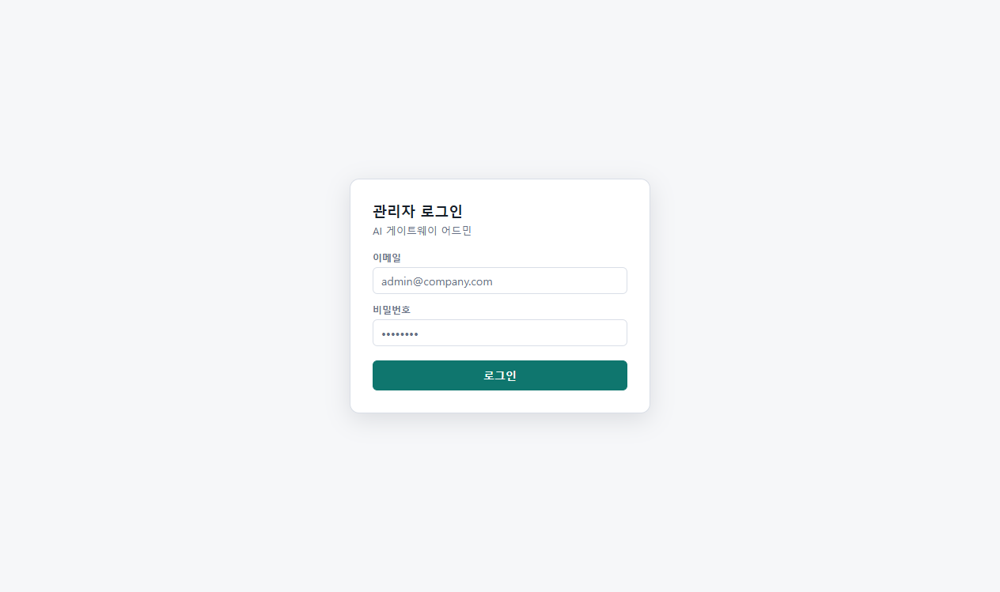
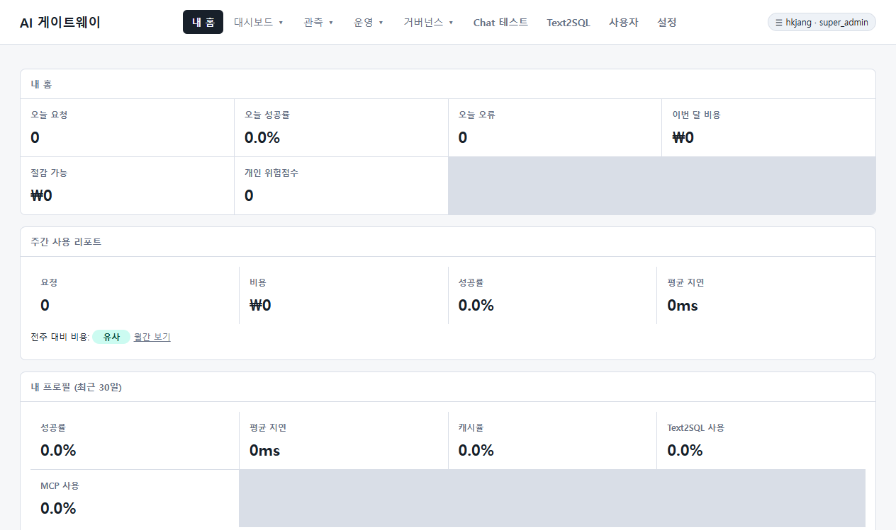
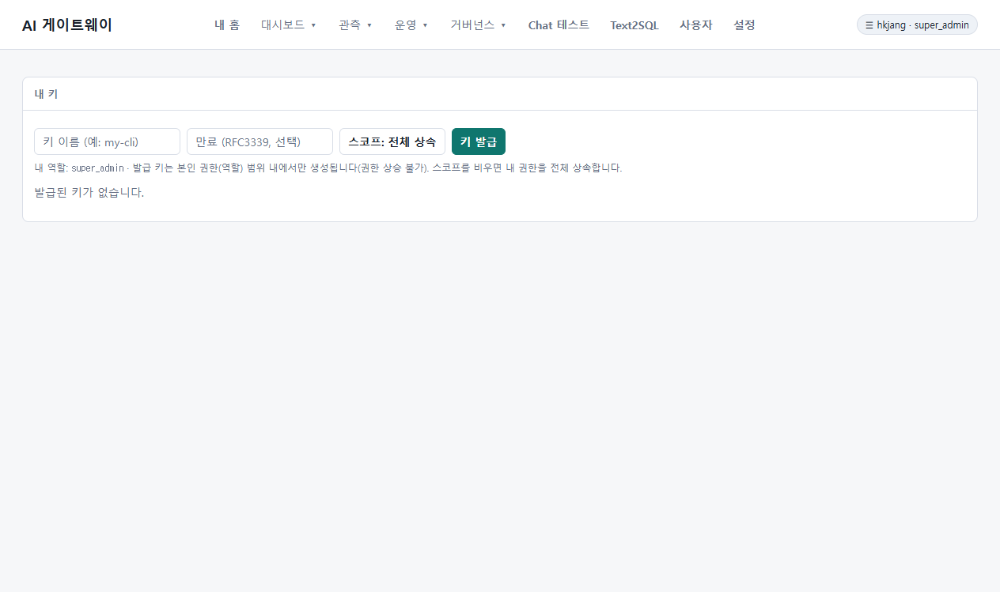

# AI Proxy Gateway - Developer 상세 사용 가이드

본 가이드는 AI Proxy Gateway에 접근하는 **Developer (개발자)** 역할의 사용자가 포털 웹 콘솔을 활용하고, 본인의 API Key를 스스로 발급 및 관리(수명주기 제어)하며, 로컬 개발 도구(IDE)에 연동하는 모든 과정을 실제 서비스 구동 화면 스크린샷과 함께 상세히 설명합니다.

> [!NOTE]
> **[안내]** AI Proxy Gateway의 일부 고급 기능과 화면 레이아웃은 성능 고도화를 위해 지속적으로 개발 및 개선 중에 있습니다. 이에 따라 실제 콘솔 화면이나 세부 작동 방식은 본 가이드의 설명과 미세한 차이가 발생할 수 있으므로 양해 부탁드립니다.

---

## 1. 안전한 포털 로그인 (Secure Portal Login)

AI Proxy Gateway는 강력한 역할 기반 접근 통제(RBAC)를 탑재하고 있어, 개발자가 웹 포털 및 API 기능을 사용하기 위해선 본인 인증을 먼저 거쳐야 합니다.


*그림 1: AI Proxy Gateway 로그인 화면*

### 1.1 로그인 방식 및 단계
1. **이메일 및 패스워드 인증**:
   - 활성화된 본인의 개발자 계정 이메일(예: `your-email@company.com`)과 사전에 안전하게 발급받은 개인 비밀번호(보안을 위해 가이드 내 비공개)를 입력창에 각각 타이핑합니다.
   - 우측 하단의 **[로그인]** 버튼을 클릭하여 인증을 마칩니다.
2. **SSO (Single Sign-On) 로그인 연동**:
   - 사내 OIDC 연동(Keycloak 등)이 활성화되어 있을 경우, 화면 하단에 **"SSO 로그인"** 버튼이 함께 제공됩니다. 이를 활용하면 사내 통합 계정을 이용해 비밀번호 입력 없이 한 번에 로그인이 가능합니다.

> [!IMPORTANT]
> **[사내 보안 권장 사항]** 보안 규정 준수 및 계정 라이프사이클의 안전한 관리를 위해, 가급적 사내 연동된 **SSO Keycloak 로그인 인증 방식**을 우선적으로 활용하여 접근할 것을 강력히 권장합니다. 로컬 계정(이메일/비밀번호) 로그인 방식은 SSO 장애 등 비상 상황 시 예외적 수단으로만 활용해 주십시오.

> [!NOTE]
> 최초 로그인 성공 시, 계정에 기본적으로 `developer` 역할이 부여되며 개인 맞춤화 대시보드로 자동 연결됩니다.

---

## 2. 내 홈: 개인화 대시보드 (My AI Home)

로그인이 성공하면 개발자 전용 맞춤형 랜딩 화면인 **"내 홈 (My AI Home)"**으로 이동합니다. 개발 업무를 둘러싼 통계, 비용, 보안 정책 차단 이력, 사용 가능한 AI 자산들이 단일 화면에 유기적으로 시각화되어 제공됩니다.


*그림 2: 개발자 개인화 랜딩 - 내 홈 (My AI Home)*

### 2.1 핵심 구성 요소 및 기능 명세
* **오늘 사용량 KPIs**:
  - 오늘 하루 동안 누적된 요청수, 오류수, 평균 성공률을 실시간 제공하며, **이번 달 누적 원화 비용**과 라우팅 보정을 통해 아낀 **절감 가능 비용**을 실시간 계량화하여 보여줍니다.
* **내 프로필 (최근 30일)**:
  - 나의 평균적인 호출 성공률, 평균 응답 지연 시간(ms), 캐시 적중률(%), Text2SQL 및 MCP 사용 빈도를 분석하고 자연어로 요약 보고합니다.
* **내 사용 패턴 & 자주 쓰는 모델**:
  - 내 코딩 트래픽을 분류하여 탑 작업 유형(예: Refactor, Debug 등) 및 많이 쓰는 MCP 도구 통계를 제공하고, 모델별 호출수와 비용을 테이블로 깔끔하게 정리해 줍니다.
* **최근 차단 사유 (Security Firewall)**:
  - 작업 도중 실수로 Secret(비밀번호, API 키 등)을 코드에 임베딩했거나 위험 구문으로 인해 게이트웨이 보안 방화벽에 걸린 경우, **"매칭된 보안 규칙"**과 **"상세 차단 사유"**를 인라인으로 투명하게 노출하여 자가 수정을 유도합니다.
* **내 업무 추천 모델**:
  - 최근 작업 통계를 기반으로 개별 추천하는 모델(👍) 및 지양하는 모델(⚠) 정보를 인라인 배지로 안내하며, 팀 전체 멀티모델 평가에서 가장 점수가 높았던 **"팀 우승 모델(🏆)"** 리더보드를 함께 띄워 선택을 돕습니다.
* **내가 사용 가능한 Skill**:
  - 사내에 배포된 공인 AI 프롬프트 지침서(Skill)의 카탈로그입니다. 사용 후 평점 피드백을 주거나, 접근 권한이 없는 스킬에 대해서는 **[접근 요청]** 결재를 올릴 수 있습니다.
* **최근 요청 / 영수증 (Request Receipt)**:
  - 내가 호출한 API 상세 내역을 나열하고, **[영수증 보기]** 버튼을 클릭하면 토큰 상세량(Prompt/Completion/Cached), 지연, 원화 비용 외에도 **어떤 이유와 판단으로 해당 LLM 모델이 선택되어 라우팅되었는지(라우팅 이유)** 세부 인과관계를 명세합니다.

---

## 3. 내 키 발급 및 수명주기 관리 (API Key Self-Service)

개발자가 로컬 IDE(Cursor, VS Code 등)나 파이썬 스크립트에서 AI Gateway를 연동하려면, 전용 **Proxy API Key**가 필수적입니다. 본 포털은 관리자 승인 대기 없이 스스로 키를 통제할 수 있는 셀프서비스 패널을 지원합니다.


*그림 3: 개발자 API Key 셀프서비스 패널*

### 3.1 API Key 수명주기 제어 단계
1. **신규 발급 (Create)**:
   - 우측 상단 **[새 키 발급]** 버튼을 누릅니다.
   - 키 이름(예: `cursor-macbook-key`)을 입력하고, 필요한 스코프(`self`, `mcp:use` 등)를 선택한 뒤 발급을 완료합니다.
   - **주의**: 발급된 비밀 시크릿 값(Secret)은 **최초 1회만 화면에 표시**되며 닫은 후엔 다시는 볼 수 없으므로, 즉시 복사하여 사내 안전한 비밀 저장소에 관리하십시오.
2. **스코프 조율 (Scope Edit)**:
   - 보안 상황이나 사용 용도에 따라 키의 권한을 축소/확장하고 싶을 때, 목록의 **[스코프]** 버튼을 눌러 체크박스로 실시간 조율 및 저장할 수 있습니다.
3. **키 회전 (Rotate)**:
   - 사용 중인 키의 유출이 우려되거나 만료 임박 시, **[회전]** 버튼을 클릭합니다.
   - 기존 키와 동일한 권한을 가진 **신규 키**가 즉시 발급(시크릿 1회 노출)되며, 기존 키는 **12시간의 임시 유예기간(Grace Period)** 동안 여전히 유효하게 작동하다가 자동 폐기됩니다. 이 유예기간 덕분에 개발자는 로컬 개발 환경의 환경설정을 중단 없이 안전하게 신규 키로 교체할 수 있습니다.
4. **즉시 폐기 (Revoke)**:
   - 키를 분실했거나 프로젝트가 만료된 경우 **[폐기]** 버튼을 누르면, 해당 키는 즉각 무효화 처리되어 영구적으로 차단됩니다.

> [!WARNING]
> 모든 API Key는 **개발자 본인 계정의 통합 사용량 예산 한도(Quota)**를 공유하여 차감되므로, 다수의 키를 발급하더라도 통합 한도 내에서 안전하게 비용이 제어됩니다.

---

## 4. 핵심 API 호출 가이드 (OpenAI Compatible API)

AI Proxy Gateway는 업계 표준 규격인 **OpenAI Compatible API** 스펙을 네이티브로 완벽히 지원합니다. 개발자는 복잡한 통합 라이브러리 전환 없이, 기존 OpenAI SDK 및 표준 HTTP Client(Curl)를 활용해 게이트웨이가 관리하는 다양한 사내 AI 모델들을 일관되게 호출할 수 있습니다.

### 4.1 Curl을 활용한 Chat Completion API 호출 예시
터미널 환경에서 가장 직관적으로 게이트웨이 API를 호출하는 구조입니다. `Authorization` 헤더에 본인의 Proxy API Key를 Bearer 형식으로 탑재하여 쏩니다.

```bash
curl https://{gateway-url}/v1/chat/completions \
  -H "Content-Type: application/json" \
  -H "Authorization: Bearer <YOUR_API_KEY>" \
  -d '{
    "model": "vibe/auto",
    "messages": [
      {"role": "user", "content": "AI Proxy Gateway의 핵심 기능 3가지를 요약해 줘."}
    ],
    "temperature": 0.7
  }'
```

### 4.2 Python OpenAI SDK 연동 예시
파이썬 환경에서는 공식 `openai` 패키지를 그대로 재사용하되, `base_url`과 `api_key` 옵션만 게이트웨이 정보로 치환하여 유기적으로 연동합니다.

```python
from openai import OpenAI

# AI Gateway의 정식 주소와 본인의 발급 API Key 바인딩
client = OpenAI(
    base_url="https://{gateway-url}/v1",
    api_key="<YOUR_API_KEY>"
)

# 모델 명에 vibe/auto (자동 최적 라우팅) 혹은 개별 모델 명 입력
response = client.chat.completions.create(
    model="vibe/auto",
    messages=[
        {"role": "user", "content": "안녕하세요! 코드 분석 도구를 기동해 주세요."}
    ],
    temperature=0.2
)

print(response.choices[0].message.content)
```

---

## 5. 로컬 환경 및 개발 도구 연동 (IDE & MCP Integration)

AI Proxy Gateway는 터미널 및 외부 IDE 에이전트가 Gateway의 고유 기능들을 도구로 호출할 수 있게 해주는 **자체 MCP(Model Context Protocol) Server** 규격을 내장하고 있습니다.

### 5.1 Cursor / Claude Desktop / Roo Code 연동 설정
'내 홈'의 하단 **"내 개발도구 연결하기 (MCP)"** 카드에서 설정을 복사해 로컬 IDE 환경에 연동합니다.

```json
{
  "mcpServers": {
    "vibe-gateway": {
      "url": "https://{gateway-url}/mcp/gateway",
      "headers": {
        "Authorization": "Bearer <YOUR_API_KEY>"
      }
    }
  }
}
```

- 위의 `<YOUR_API_KEY>` 부분에 이전 단계에서 발급받은 본인의 **Proxy API Key**를 삽입하면 즉시 연동이 마무리됩니다.
- 연동 시 로컬 AI 에이전트가 `gateway_list_models`, `gateway_estimate_cost`, `gateway_check_quota`, `gateway_route_preview` 등의 7대 자체 지능 도구를 직접 구동할 수 있어, 코딩 도중 언제든 예산이나 최적 모델 조회를 협업 툴로 수행할 수 있습니다.

### 5.2 연결 진단기 (Connection Doctor)
- 만약 로컬 클라이언트에서 연동이 원활하게 작동하지 않을 때, 포털의 **"연결 진단"** 기능을 활용하십시오.
- 대상 클라이언트(OpenAI SDK, Cursor, Roo Code, Claude Desktop 등)를 선택하고 **[연결 진단]** 버튼을 클릭하면, 서버가 즉시 인프로세스(in-process) 가상 통신을 흘려보내 **인증, 스코프 매핑, 모델 권한, Quota 한도, endpoint 도달성, MCP initialize 프로토콜**을 항목별로 1초 만에 자가 검증하고, 문제가 식별될 경우 즉시 구체적인 **[조치 가이드]**를 화면에 제공해 줍니다.
